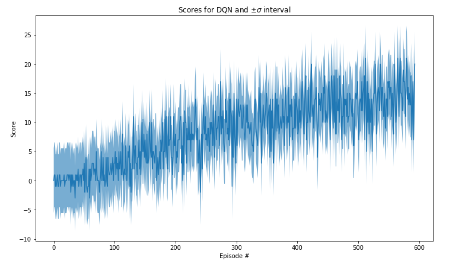

# Deep Q-Network (DQN) Reinforcement Learning using PyTorch and Unity ML-Agents

This folder is dedicated to the implementation of the Unity ML-Agents within the Udacity Artificial Intelligence Nanodegree. Done in Pytorch.
In tne environment an agent is trained to navigate (and collect bananas!) in a large, square world. 

The files in the python/. directory are the ML-Agents toolkit files and dependencies required to run the Banana environment. For more information about the Unity ML-Agents Toolkit visit: 

https://github.com/Unity-Technologies/ml-agents

A reward of +1 is provided for collecting a yellow banana, and a reward of -1 is provided for collecting a blue banana. Thus, the goal of your agent is to collect as many yellow bananas as possible while avoiding blue bananas.

The state space has 37 dimensions and contains the agent's velocity, along with ray-based perception of objects around the agent's forward direction. Given this information, the agent has to learn how to best select actions. Four discrete actions are available, corresponding to:

    0 - move forward.
    1 - move backward.
    2 - turn left.
    3 - turn right.

The task is episodic, and in order to solve the environment, your agent must get an average score of +13 over 100 consecutive episodes.

The repository includes the following DQN related files:

    dqn_agent.py -> dqn-agent implementation
    model.py -> example PyTorch neural network for vector based DQN learning
    Navigation.ipynb -> initializes and implements the training processes for a DQN-agent.

Code expanded and adapted from code examples provided by Udacity DRL Team, 2022.
https://github.com/udacity/deep-reinforcement-learning#dependencies

The repository also includes Windows versions of a simple Unity environment, Banana, for testing. This Unity application and testing environment was developed using ML-Agents Beta v0.4. The version of the Banana environment employed for this project was developed for the Udacity Airbus Artificial Inteligence Nanodegree.

The files in the python/. directory are the ML-Agents toolkit files and dependencies required to run the Banana environment. For more information about the Unity ML-Agents Toolkit visit: https://github.com/Unity-Technologies/ml-agents

For further details about DQN see: Mnih, V., Kavukcuoglu, K., Silver, D., Rusu, A. A., Veness, J., Bellemare, M. G., ... & Petersen, S. (2015). Human-level control through deep reinforcement learning. Nature, 518(7540), 529.

https://web.stanford.edu/class/psych209/Readings/MnihEtAlHassibis15NatureControlDeepRL.pdf

 

